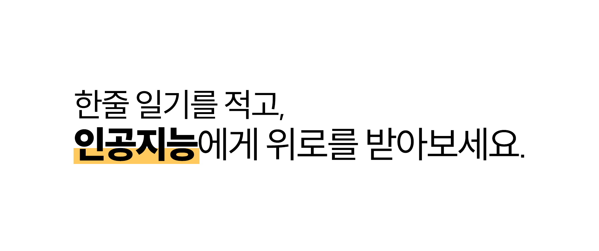
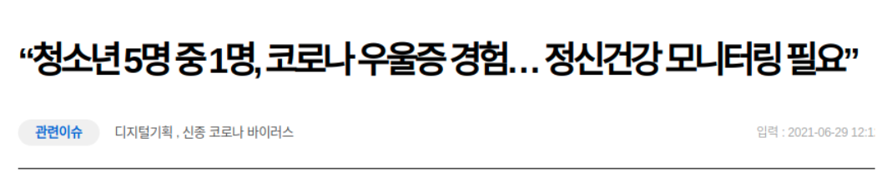
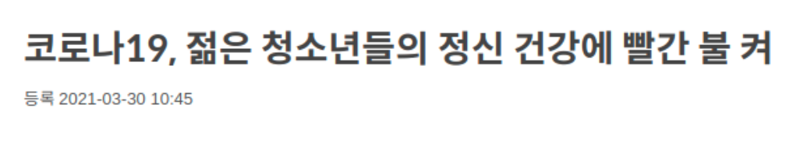
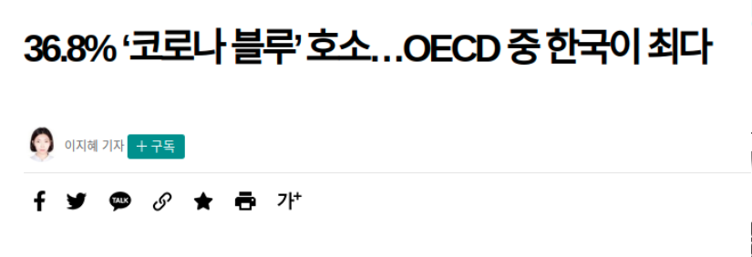
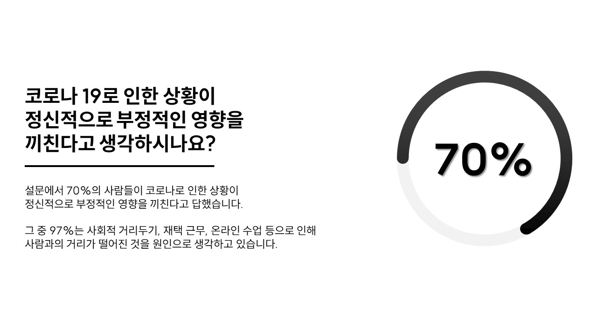
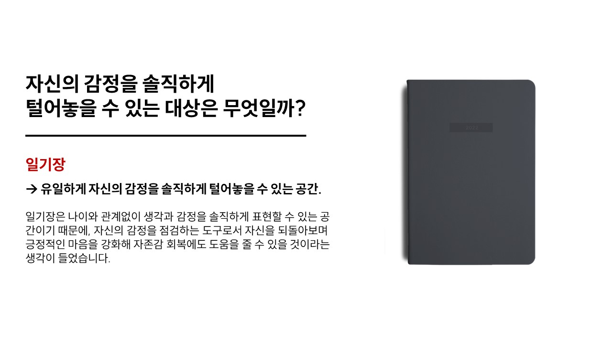
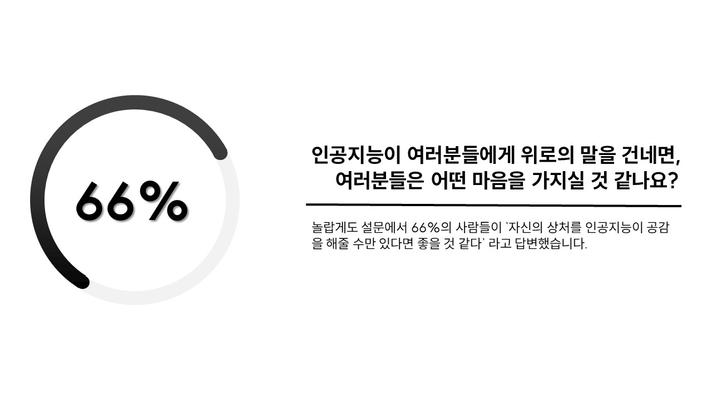
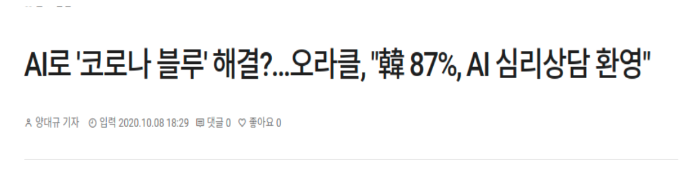
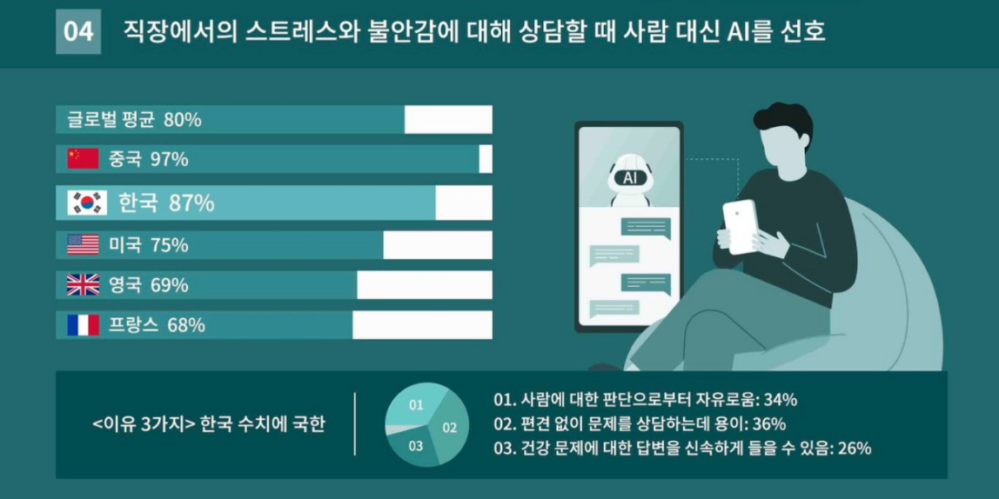

    
    <h1><b>Emotion Diary</b></h1>

# Introduce
>
> 이 Organization은 2021.07.29 ~ 2021.07.30 '신세계 아이앤씨'에서 진행한 `2021 Hello New World` 해커톤에서 우수상을 수상한 `Machine.new()`팀의 아이디어를 구현하기 위해 조직되었습니다.
>

# Content
1. <a href="#왜-우리는-이러한-아이디어를-정했나">왜 우리는 이러한 아이디어를 정했나?</a>
2. <a href="#과연-인공지능의-답변이도움이-될까">과연 인공지능의 답변이 도움이 될까?</a>
3. <a href="#개발-현황">개발 현황</a>
4. <a href="#팀원-소개">팀원 소개</a>

# 왜 우리는 이러한 아이디어를 정했나
해커톤 주제인 `[코로나로 대두되거나 심화된 사회문제를 IT기술로 해결방안 제시하기]`를 보고, '코로나로 인해 생긴 문제가 무엇일까?'를 먼저 생각해봤습니다.

코로나가 점점 잠잠해 지고 있고 상황은 이전보다 나아지고 있지만, '정말로 그걸로 모든 것이 끝난 것일까?' 라는 의문을 가지면서 '코로나 블루 (코로나의 코로나와 우울하다는 뜻의 블루를 합쳐만든 신조어)' 문제에 대해 고민을 하게 되었습니다.

OECD에 따르면 지난 10년간 전 세계적으로 보이지 않던 정신질환 유병률이 코로나 펜데믹을 기점으로 급격히 늘어났다고 합니다.

OECD 국가 중, 한국이 36.8%로 우울감을 느끼거나 우울증이 있는 비중이 가장 높다고 합니다. 이러한 자료들을 토대로, '코로나 블루'는 우리나라에서 더욱이 빨리 해결되어야 할 사회적 문제에 해당한다고 볼 수 있습니다.

많은 사람이 코로나로 인해 나의 삶이 불행하다는 생각, 우울증은 누구나 겪고 있다는 생각과 함께 스트레스를 많이 받는다는 연구조사를 발견하게 되었습니다.

저희는 10대, 20대, 30대, 그리고 40대 250명을 대상으로 구글 설문조사를 진행했습니다. 응답자 중 70%가 코로나로 인한 상황이 정신적으로 부정적인 영향을 끼친다고 답했고, 그 중 97%가 사회적 거리두기, 재택 근무, 온라인 수업 등이 그 이유라고 응답했습니다.

디지털 기술의 보급으로 사람들의 소통 속도는 눈에 띄게 빨라졌으나, 점점 각박해지는 세상으로 인해 사회로부터 오히려 멀어지고, 정신적으로 힘들어하는 사람들이 보였습니다.
이러한 문제는 코로나의 여파로 사회적 거리 두기를 시행하며 더욱더 깊어졌습니다.

저희는 이런 문제를 해결하기 위해, 개인의 감정을 들어주고, 똑똑하며, 자신을 진정으로 이해해주는 진정한 친구가 필요하다고 생각했습니다.

그러나 대부분 사람은 심리적 고통이나 문제를 겪는다는 것을 다른 사람들에게 솔직하게 얘기하지 않으려면 안다면 창피할 것 같다고 생각하는 경우가 많으며, 자신의 감정을 솔직하게 털어놓을 대상을 찾기 힘들 거라고 생각이 들었습니다.

코로나 때문이 아니더라도, 개인주의가 발전하는 현시대에 스스로 관심 가지면서 개인의 정체성에 대해 고민하는 사람들이 많으며, 나를 공감해주는 사람은 더더욱 부족하다고 느꼈습니다.

**그러다가 일기장을 생각해냈습니다. 일기장은 나이와 관계없이 생각과 감정을 솔직하게 표현할 수 있는 공간이기 때문에, 자신의 감정을 점검하는 도구로서 자신을 되돌아보며 긍정적인 마음을 강화해 자존감 회복에도 도움을 줄 수 있을 것이라는 생각이 들었습니다.**

하지만 일기를 적는 것만으로는 힘들다고 판단했습니다. 자신의 감정을 이해해주는 무언가가 있어야 한다고 생각했는데요. 그래서 저희는 일기장에 사용자가 글을 쓰면 인공지능이 사용자의 감정을 분석하여 공감하고 위로해줌으로써 사용자들의 감정적 문제를 완화해줄 수 있겠다는 생각에 `일기장 + 챗봇`을 만들기로 했습니다.

# 과연 인공지능의 답변이 도움이 될까

아무리 그래도 전문 상담사가 공감해 주는 것도 아니고, 인공지능이 공감해준다고 효과가 있을까요?

저희는 또 설문조사를 이용하기로 했습니다. 설문 결과는 놀랍게도 호의적이었습니다.
응답자 중 66%가 '자신의 상처를 인공지능이 공감을 해줄 수만 있다면 좋을 것 같다'라고 답변했습니다.

혹시 설문 결과에 대해서 의문을 가지고 계신가요? 다른 결과들도 가지고 와봤어요.

설문조사 결과와 일치하는 것을 보아하니, 저희는 이런 결론을 세우게 됐습니다.
*인공지능이 인간의 감정적인 문제를 해결할 수 있다.*

# 개발 현황

- [Front](https://github.com/DKSH-EmotionDiary/Front)
- [Back](https://github.com/DKSH-EmotionDiary/Back)

# 팀원 소개

|  | 
| - | - | 
| [ParkEunHyeok](https://github.com/ParkEunHyeok) | [kitae0522](https://github.com/kitae0522) |

    <b>Made with ❤, from EmotionDiary Team</b>

